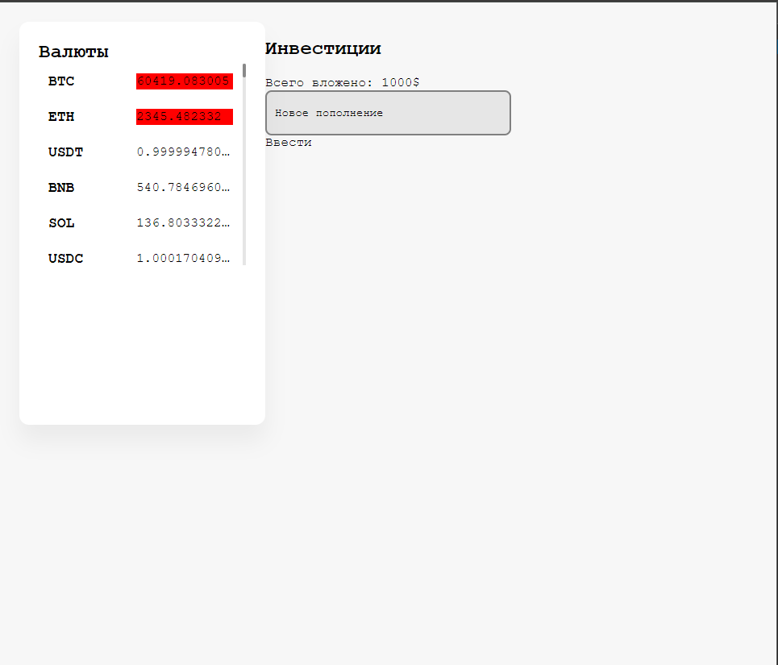
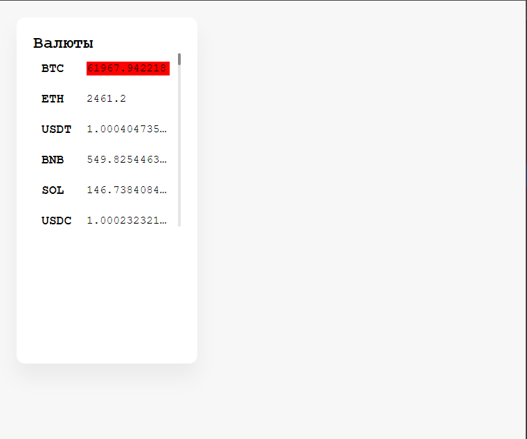
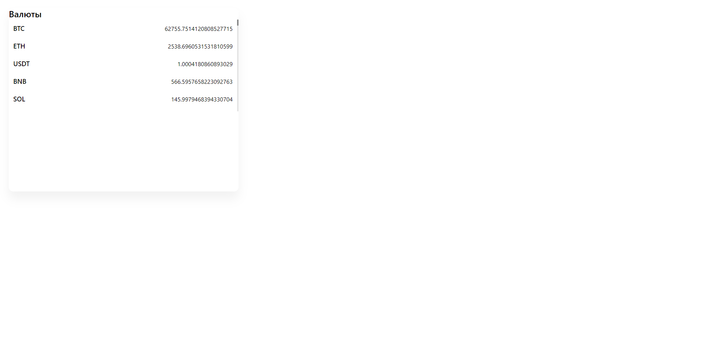
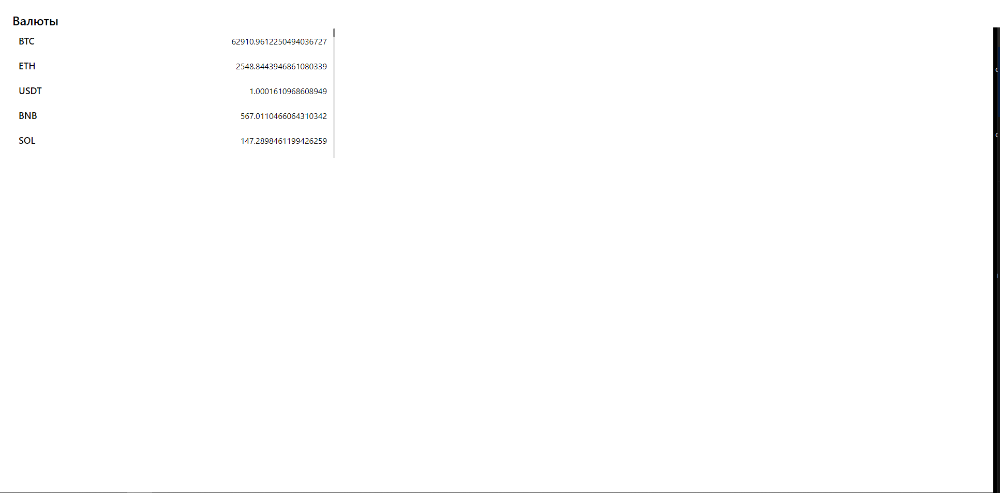

# coindashboard

Приложение для отслеживания курса криптовалют

## Выпуски

### dev-1.0.4

1. Добавлен базовый инпут и структура нового блока
   

### dev-1.0.3

1. Добавлена GSAP-анимация на изменение цены
2. Добавлен обработчик для получение цен в реальном времени
   

### dev-1.0.2

1. Добавлена инициализхация scss и css переменных для двух тем
   

### dev-1.0.1

1. Добавлен обработчик для получения списка монет и первичная верстка
   

### dev-1.0.0

1. Инициализация проекта
